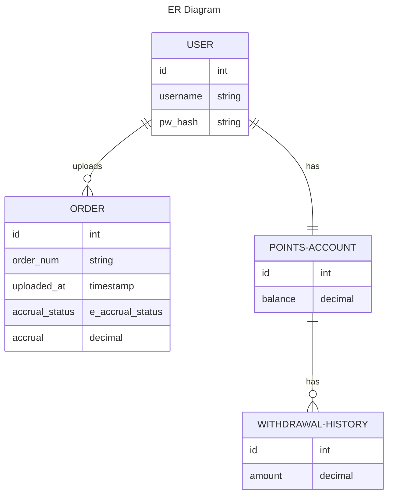

```mermaid
---
title: ER Diagram
---
erDiagram
    USER ||--o{ ORDER : uploads
    USER {
        id int
        username string
        pw_hash string
    }
    ORDER {
        id int
        order_num string
        uploaded_at timestamp
        accrual_status e_accrual_status
        accrual decimal
    }
    USER ||--|| POINTS-ACCOUNT : has
    POINTS-ACCOUNT {
        id int
        balance decimal
    }
    POINTS-ACCOUNT ||--o{ WITHDRAWAL-HISTORY : has
    WITHDRAWAL-HISTORY {
        id int
        amount decimal
    }
```