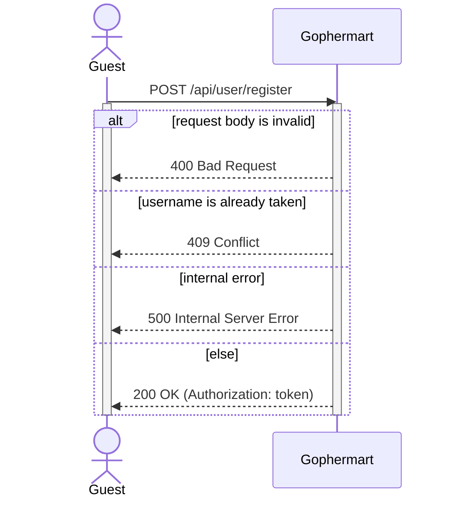
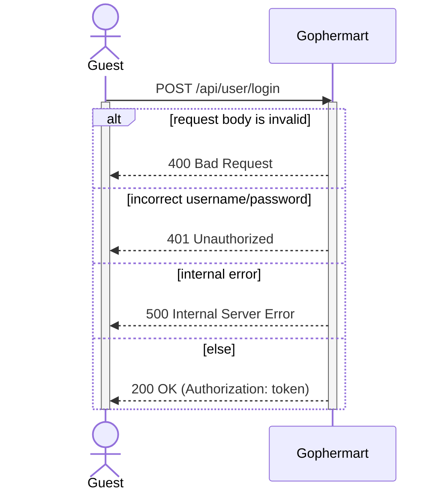
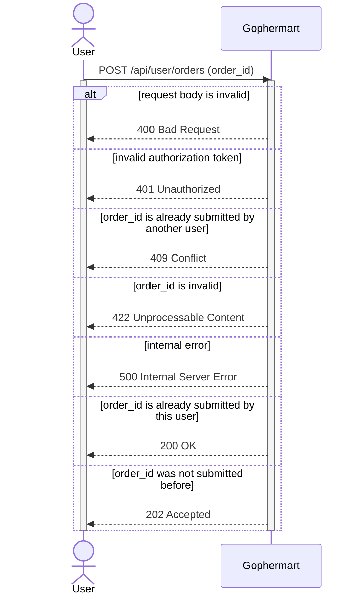
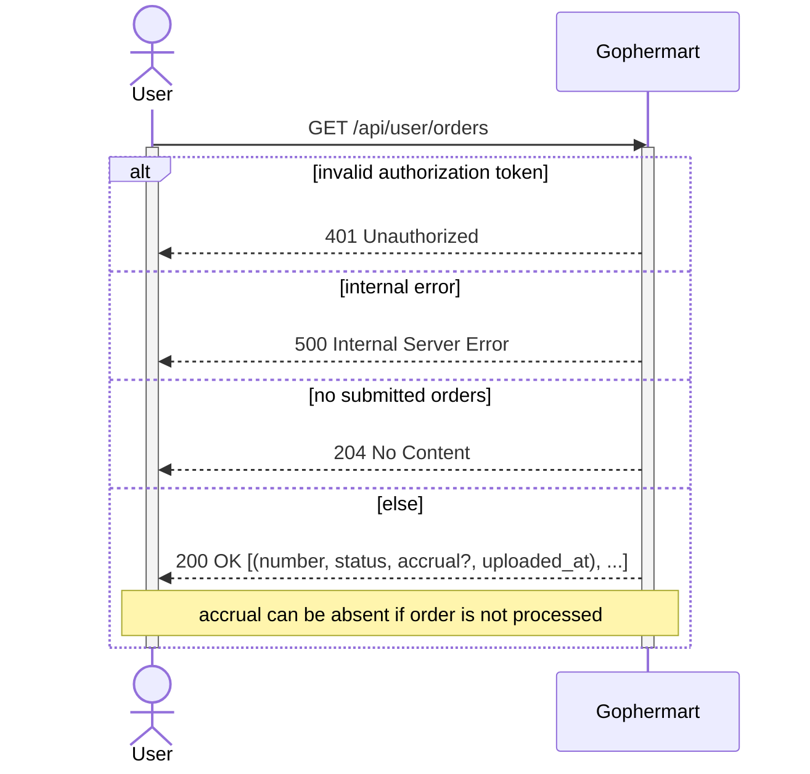
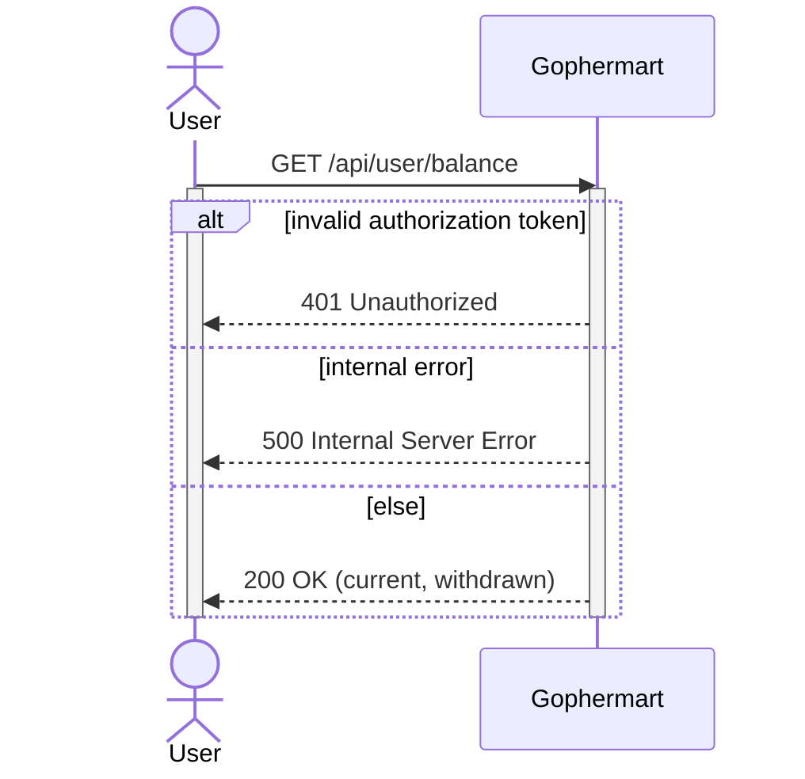
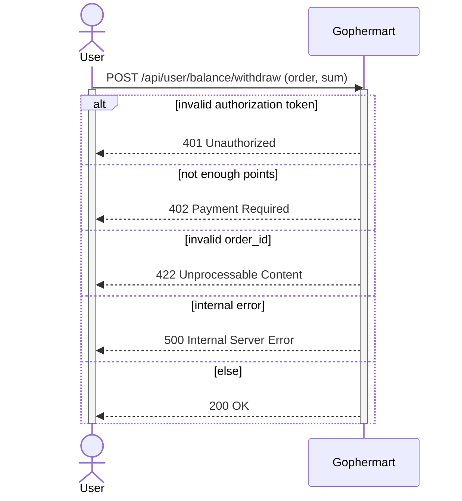
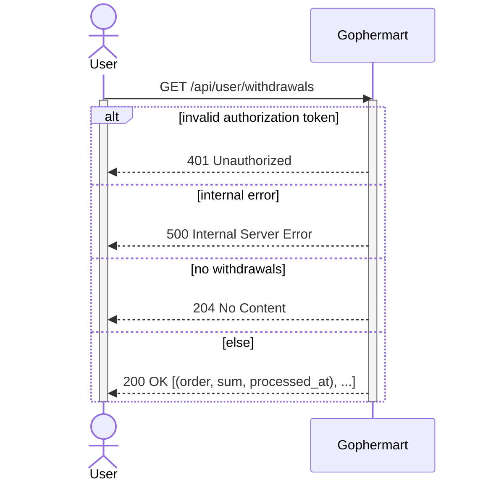

# Регистрация пользователя

# Аутентификация пользователя

# Загрузка номера заказа

# Получение списка загруженных номеров заказов

# Получение текущего баланса пользователя

# Запрос на списание средств

# Получение информации о выводе средств

